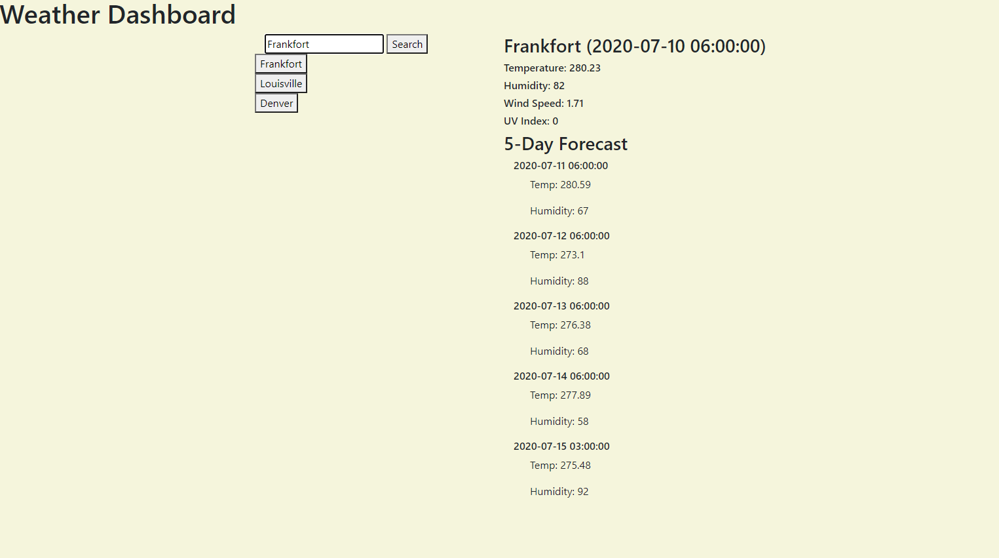

# mag-weather-dashboard

<h1>Welcome to Weather Dashboard!</h1>

[Weather Dashboard](https://magire01.github.io/mag-weather-dashboard/)

 This site allows the user to type in any US City and find the current day's weather details along with the 5 day forecast. Once a user types in a city and selects search, that search will be saved as a button that the user can click to return to that City's weather profile. 

<h3> Known Issues </h3>
<ul> Previous Searches do not stay on screen after refresh</ul>
<ul> Last searched item does not appear on refresh </ul>
<ul> Missing functionality for changing the color of the UV Index Field </ul>
<ul> Missing images depicting cloudy/sunny/rainy weather </ul>
 
 

 Author: Mark Gire 
